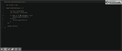

# Categorize New Members

## The Problem

The Western Suburbs Croquet Club has two categories of membership, Senior and Open. They would like your help with an application form that will tell prospective members which category they will be placed.

- To be a senior, a member must be at least 55 years old and have a handicap greater than 7. In this croquet club, handicaps range from -2 to +26; the better the player the lower the handicap.

### Input
- Input will consist of a list of lists containing two items each. Each list contains information for a single potential member. Information consists of an integer for the person's age and an integer for the person's handicap.

###  Example Input
- [[18, 20],[45, 2],[61, 12],[37, 6],[21, 21],[78, 9]]
### Output
- Output will consist of a list of string values (in Haskell: Open or Senior) stating whether the respective member is to be placed in the senior or open category.

### Example Output
- ["Open", "Open", "Senior", "Open", "Open", "Senior"]
---
## The Solution

The problem is solved with an if statement nested inside of a forEach method, as demonstrated below...

